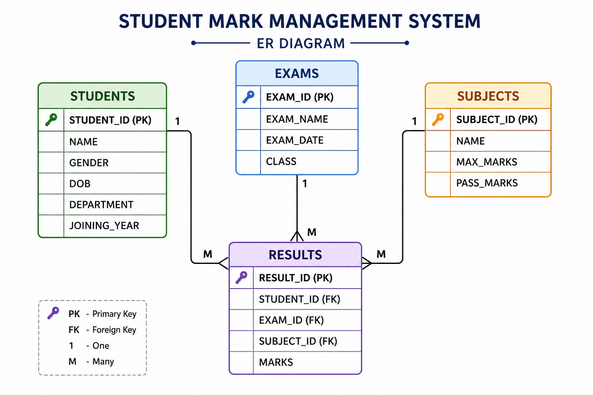

# 🎓 Student Mark Management System (SQL Project)

## 📌 Project Overview

The **Student Mark Management System** is a structured SQL database project designed to efficiently manage student academic data, including subjects, exams, and results.

It demonstrates strong knowledge of **database design, relationships, and advanced SQL queries**.

---

## 🗂️ Database Schema

The system includes four main tables:

* **STUDENTS** – Stores student details
* **SUBJECTS** – Stores subject information
* **EXAMS** – Stores exam details
* **RESULTS** – Stores marks and performance

---

## 🧩 ER Diagram



```
+-------------+        +-------------+        +-------------+
|  STUDENTS   |        |   RESULTS   |        |  SUBJECTS   |
+-------------+        +-------------+        +-------------+
| STUDENT_ID  |<------>| STUDENT_ID  |        | SUBJECT_ID  |
| NAME        |        | RESULT_ID   |        | NAME        |
| GENDER      |        | EXAM_ID     |------->| MAX_MARKS   |
| DOB         |        | SUBJECT_ID  |------->| PASS_MARKS  |
| DEPARTMENT  |        | MARKS       |        +-------------+
| JOIN_YEAR   |        +-------------+
+-------------+               |
                              |
                              v
                        +-------------+
                        |   EXAMS     |
                        +-------------+
                        | EXAM_ID     |
                        | EXAM_NAME   |
                        | EXAM_DATE   |
                        | CLASS       |
                        +-------------+
```

---

## ⚙️ Features

* 📊 Student Report Card Generation
* 🏆 Ranking using Window Functions
* 📈 Performance Analysis
* ✅ Pass/Fail Calculation
* 🔄 Improvement Tracking

---

## 🛠️ Technologies Used

* SQL (Oracle / MySQL)
* Relational Database Concepts

---

## 🚀 How to Run

1. Open SQL environment (Oracle SQL Developer / MySQL Workbench)
2. Execute `student_mark_system.sql`
3. Run queries to view results

---

## 📊 Sample Queries

* Student Report Card (CASE statement)
* Class Ranking (RANK, DENSE_RANK)
* Pass/Fail Analysis
* Gender-wise Performance

---

## 📁 Project Structure

```
student-mark-management-system/
│
├── student_mark_system.sql
├── README.md
└── ER_Diagram.png
```

---

## 🔮 Future Enhancements

* Add Stored Procedures
* Implement Triggers
* Develop Web Interface (React + Node.js)
* Real-time analytics dashboard

---

## 👩‍💻 Author

**Ezhilarasi A**
📧 [ezhilarasia96@gmail.com](mailto:ezhilarasia96@gmail.com)
🔗 https://github.com/Ezhil-17

---

## ⭐ Support

If you found this project useful, please give it a ⭐ on GitHub!
